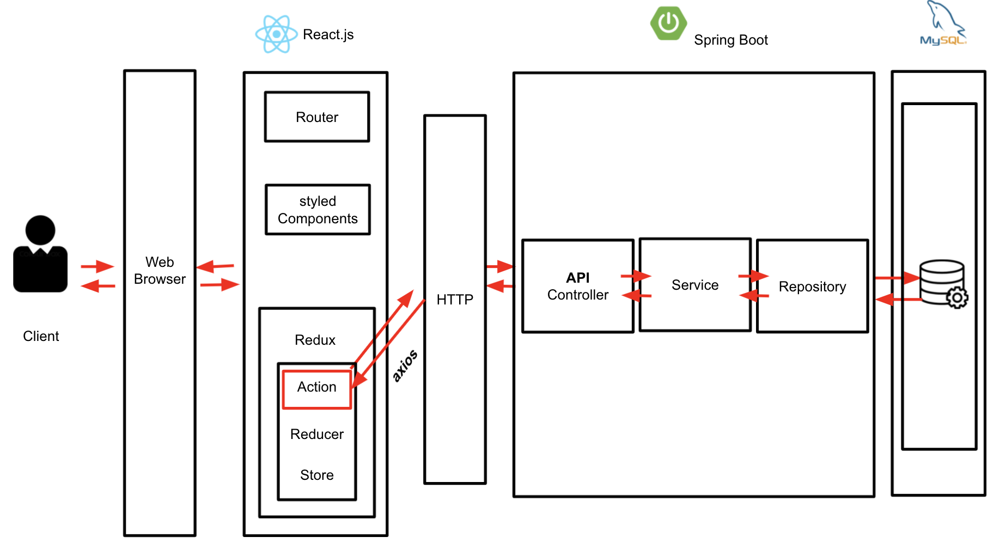

<hr>

## :bulb: Contributor
### Frontend: 김민환, 남하은, 변대웅
### Backend: 조원식, 진수연

<br>

## :heavy_check_mark: 개발 기간
### 2021.07.12 ~ 2021.08.20 (6주)
<br>

## :heavy_check_mark: LinkedBook 서비스 개요
- 자신의 책방을 온라인에서 운영하고 동네 사람들과 중고책을 거래하면서 책과 사람을 LINK 해주는 서비스.
- 판매자가 중고책의 가격을 결정하는 것이 아닌 책 상태 정보에 따라 가격이 정해져 구매자와 판매자가 합리적인 가격으로 거래를 할 수 있다.
- 카카오 책 API를 통해 책의 정확한 정보와 사람들의 한줄평을 통해 다양한 책의 정보를 확인할 수 있다.

<br><br>

## :heavy_check_mark: 기술 스택




<br><br>

## :heavy_check_mark: 프로젝트 세팅 방법
- [Frontend](./front/README.md)
- [Backend](./backend/README.md)

<br><br>

## :heavy_check_mark: LinkedBook 주요 기능
### 1. 중고책 거래 서비스
<table>
    <tbody>
        <tr>
            <td rowspan=4>
            
            </td>
        </tr>
        <tr>
            <td>1. 사용자의  지역 기반으로 거래 목록 확인</td>
        </tr>
        <tr>
            <td>2. 채팅을 통해 사용자간 연결</td>
        </tr>
        <tr>
            <td>3. 관심책 등록으로 해당 책에 대한 거래 알람 기능</td>
        </tr>
    </tbody>
</table>

### 2. 책 정보 커뮤니티
<table>
    <tbody>
        <tr>
            <td rowspan=4>
            
            </td>
        </tr>
        <tr>
            <td>1. 책 정보 조회</td>
        </tr>
        <tr>
            <td>2. 책 한줄평을 통해 유저간 소통</td>
        </tr>
        <tr>
            <td>3. 사용자가 가장 많이 선택한 태그 3개가 해당 책을 대표하는 태그로 선정</td>
        </tr>
    </tbody>
</table>

### 3. 판매 게시글 작성
<table>
    <tbody>
        <tr>
            <td rowspan=4>
            
            </td>
        </tr>
        <tr>
            <td>1. 판매게시글을 통해 거래글 작성</td>
        </tr>
        <tr>
            <td>2. 책 정가제 도입</td>
        </tr>
        <tr>
            <td>3. 책 상태와 출간일에 따라 책 등급과 가격 자동 산정</td>
        </tr>
    </tbody>
</table>

### 4. 사용자 프로필
<table>
    <tbody>
        <tr>
            <td rowspan=4>
            
            </td>
        </tr>
        <tr>
            <td>1. 프로필을 통해 관심거래를 열람</td>
        </tr>
        <tr>
            <td>2. 팔로워 팔로우 기능</td>
        </tr>
        <tr>
            <td>3. 나의 활동을 확인</td>
        </tr>
    </tbody>
</table>
<br><br>

## :heavy_check_mark: 프로젝트 기여방법
### 1. Custom git flow
- 기존의 git flow 방식에서 우리의 프로젝트에 맞게 변경하였다.
- release를 삭제하고, fix라는 브랜치를 추가하였다.
1. **main**: 배포되었거나 배포될 소스가 저장되는 브랜치
2. **develop**: 다음 배포를 위해서 개발을 진행하는 브랜치, 개발 최신 상태를 항상 유지하도록 한다.
3. **hotfix**: 배포버전(main)에 생긴 문제로 긴급한 troubleshooting이 필요할 때 개발이 진행되는 브랜치
4. **feature**: 기능 단위 개발이 진행되는 브랜치
5. **fix**: 기능 개발이 끝난 후, 일어나는 이슈에 대한 처리가 진행되는 브랜치
- feature와 fix는 이슈별로 depth를 타고 내려간다.
- 즉, feature와 fix branch를 만들 때는, **/** 뒤에 처리하는 이슈 번호를 붙이도록 한다. <br>ex) feature/#0 , fix/#0
- feature 와 fix branch에서 개발이 완료되면 parent인 develop branch로 merge된다.
- ***main branch에는 직접적으로 접근할 수 없다.***

### 2. Git convention
#### 2-1. Commit Message Format
- 모든 커밋 메시지는 다음과 같은 형식을 **반드시** 따르도록 한다.
```
<type>: <message> (<issue number>)
```
- ex) <br> `feat: Add user login api (S05P12B307-0)`
<br> `fix: Fix bug to can't login using google login (S05P12B307-0)`
<br> `docs: Update README.md`

#### 2-2. Type
|type|description|
|:---:|:---:|
|feat|새로운 기능 구현에 대한 커밋|
|fix|수정 사항에 대한 커밋(ex. bug, typo)|
|docs|문서 작성에 대한 커밋(ex. 주석, README)|

#### 2-3. Message
- 커밋 메시지는 명령문으로 작성한다.
- 첫 글자는 대문자가 되도록 한다.

#### 2-4. Issue number
- 커밋과 관련된 이슈는 커밋 메시지 마지막에 **반드시** 연결하도록 한다.
- 지라에 등록된 이슈와 연동되도록 한다.

### 3. git Merge Request 
- `git pull origin develop`을 통해 최신 버전을 다운받는다.
- 로컬에서 새로운 브랜치를 생성한다.
  - `git switch -c feature/#이슈번호`
  - ex) `git switch -c feature/#26` 
  - 위의 명령은 새로운 브랜치 `feature/#26`을 생성하고 해당 브랜치로 이동하는 명령이다
- 로컬에서 작업한 것을 해당 브랜치에 업로드한다.
- `git status` : 변경사항 확인
- `git add .` -> `git commit -m 'feat: <커밋 메시지> (S05P12B307-26)'`
  - `S05P12B307-26`은 JIRA <-> GITLAB 연동을 위한 이슈 번호
  - JIRA 접속 후 각각의 이슈에서 확인 가능
- `git push origin feature/#26`
- `add` -> `commit` -> `push` 완료 후 `gitlab`의 원격저장소에 접속한다.
- 본인이 push한 커밋에 대해 `Merge Request`를 생성한다.
- 생성 후에 **develop** 브랜치로 **Merge**되는지 확인한다.
  - 맨 윗 부분에 `into develop`인지 확인
- 이후 충돌이 있다면 충돌 해결하고 `Merge`버튼을 클릭한다.