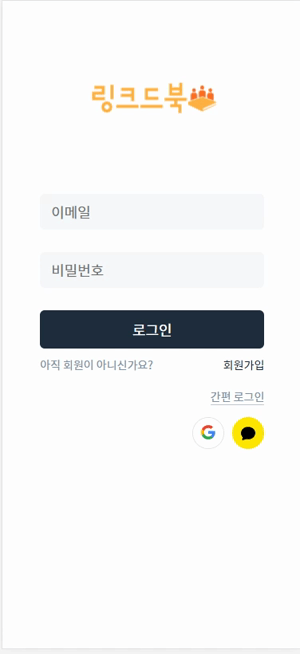

# 대전 B307 LinkedBook 시연 시나리오

### 1. 회원가입
<table>
    <tbody>
        <tr>
            <td rowspan=5>
            
            </td>
        </tr>
        <tr>
            <td>1. 본인이 사용하고 있는 이메일을 입력한 뒤에 인증 버튼을 누른다. 수 초 내에 이메일로 인증번호가 전송된다.</td>
        </tr>
        <tr>
            <td>2. 이메일에서 인증번호를 확인한 뒤에 인증번호를 입력하는 칸에 입력한다.</td>
        </tr>
        <tr>
            <td>3. 닉네임과 비밀번호를 입력하고 아래의 회원가입 버튼을 클릭한다.</td>
        </tr>
        <tr>
            <td>4. 성공적으로 회원가입이 완료된다면 회원 가입이 완료되었습니다. 메시지와 함께 로그인을 하는 페이지로 이동한다.</td>
        </tr>
    </tbody>
</table>
 

### 2. 로그인
<table>
    <tbody>
        <tr>
            <td rowspan=5>
            
            </td>
        </tr>
        <tr>
            <td>1. 회원가입에서 입력한 이메일을 이메일 입력칸에 입력한다.</td>
        </tr>
        <tr>
            <td>2. 그 다음 아래에 비밀번호를 입력한다.</td>
        </tr>
        <tr>
            <td>3. 로그인 버튼을 클릭하여 로그인을 시도한다.</td>
        </tr>
        <tr>
            <td>4. 성공적으로 로그인을 했을 때 책방을 추천해주는 페이지에 진입한다.</td>
        </tr>
    </tbody>
</table>
 

### 3. 거래하기
<table>
    <tbody>
        <tr>
            <td rowspan=4>
            
            </td>
        </tr>
        <tr>
            <td>1. 사용자의 동네를 기반으로 거래 목록을 확인할 수 있다.</td>
        </tr>
        <tr>
            <td>2. 거래 글을 클릭하면 거래에 대한 상세 페이지로 이동한다.</td>
        </tr>
        <tr>
            <td>3. 거래 상세 페이지에서 거래하기 버튼을 클릭하면 판매자와 채팅을 할 수 있다.</td>
        </tr>
    </tbody>
</table>
 

### 4. 책 정보 검색하기
<table>
    <tbody>
        <tr>
            <td rowspan=6>
            
            </td>
        </tr>
        <tr>
            <td>1. 맨 아래의 책 검색 탭을 클릭하여 책을 검색하는 페이지로 이동한다.</td>
        </tr>
        <tr>
            <td>2. 검색창에서 원하는 책의 제목을 입력한다.</td>
        </tr>
        <tr>
            <td>3. 검색 결과에서 하나의 책을 선택하여 책의 상세 페이지로 이동한다.</td>
        </tr>
        <tr>
            <td>4. 사용자들은 책을 읽고 한줄평을 작성하여 사용자에게 정보를 공유한다.</td>
        </tr>
        <tr>
            <td>5. 아래의 거래보기 버튼을 클릭하여 해당 책의 거래 목록을 확인할 수 있다.</td>
        </tr>
    </tbody>
</table>
 

### 5. 판매 게시글 작성하기
<table>
    <tbody>
        <tr>
            <td rowspan=6>
            
            </td>
        </tr>
        <tr>
            <td>1. 책 판매를 위해 하단의 노란색 플러스 버튼을 클릭한다.</td>
        </tr>
        <tr>
            <td>2. 팔고자하는 책을 검색하여 정확한 정보를 얻는다.</td>
        </tr>
        <tr>
            <td>3. 판매 게시글에 작성할 사진을 업로드한다.</td>
        </tr>
        <tr>
            <td>4. 책 상태에 따라 책의 등급이 정해진다.</td>
        </tr>
        <tr>
            <td>5. 제목과 내용 작성 후 판매 게시글을 등록한다.</td>
        </tr>
    </tbody>
</table>
 

### 6. 사용자 프로필
<table>
    <tbody>
        <tr>
            <td rowspan=6>
            
            </td>
        </tr>
        <tr>
            <td>1. 맨 위에 있는 돋보기 아이콘을 통해 사용자를 검색할 수 있다.</td>
        </tr>
        <tr>
            <td>2. 검색 결과에 출력된 사용자를 클릭하면 해당 사용자의 프로필로 이동한다.</td>
        </tr>
        <tr>
            <td>3. 다른 사용자의 프로필에서 판매중인 책과 관심을 갖고있는 책을 확인할 수 있다.</td>
        </tr>
        <tr>
            <td>4. 프로필 페이지에서 상단 오른쪽에 있는 노란색 아이콘 클릭 시 사용자의 활동 내역을 확인할 수 있다.</td>
        </tr>
        <tr>
            <td>5. 사용자의 닉네임 아래의 팔로우 또는 팔로잉 버튼을 클릭할 수 있다.</td>
        </tr>
    </tbody>
</table>
 

### 7. 신고하기
<table>
    <tbody>
        <tr>
            <td rowspan=5>
            
            </td>
        </tr>
        <tr>
            <td>1. 거래 게시글 또는 사용자에 대한 신고를 진행할 수 있다.</td>
        </tr>
        <tr>
            <td>2. 4개의 신고 항목 중에 하나를 선택한다.</td>
        </tr>
        <tr>
            <td>3. 신고 사유를 10글자 이상 200자 이하로 작성할 수 있다.</td>
        </tr>
        <tr>
            <td>4. 신고 항목과 신고 사유입력 후에 하단의 신고 버튼을 클릭한다.</td>
        </tr>
    </tbody>
</table>
